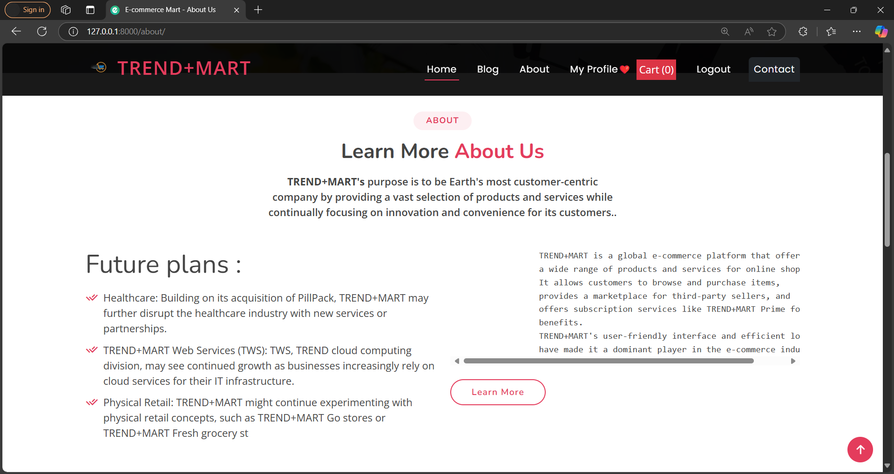

# E-commerce_Project
 An e-commerce website backend built with Django provides a robust foundation for online businesses. It manages product databases, user authentication, and order processing seamlessly, ensuring a secure and efficient shopping experience while enabling easy customization and scalability.
 by : Arjit Shukla 

## Table of Contents
- [E-commerce\_Project](#e-commerce_project)
  - [Table of Contents](#table-of-contents)
  - [Features](#features)
  - [Screenshots](#screenshots)
    - [Home Page 1](#home-page-1)
    - [Contact-Us Page](#contact-us-page)
    - [About-Us Page](#about-us-page)
    - [Product Page](#product-page)
    - [Login Page](#login-page)
    - [Sign-UP Page](#sign-up-page)
    - [Search functionality Page](#search-functionality-page)
    - [checkout Details Page](#checkout-details-page)
    - [E-commerce-blogs Page](#e-commerce-blogs-page)
    - [payment paytm Page](#payment-paytm-page)
  - [Technologies Used](#technologies-used)
  - [Setup Instructions](#setup-instructions)
  - [Usage](#usage)
  - [Contributing](#contributing)


## Features
- **User Authentication:** Secure user registration, login, reset password, and profile management.
- **Product Catalog:** Browse and search products with detailed descriptions and images.
- **Shopping Cart:** Add, update, and remove items from the cart seamlessly.
- **Checkout Process:** Smooth checkout flow with order summary and address management.
- **Payment Integration:** Integrated with Razorpay for secure online payments.
- **Order Management:** View order history and status updates.
- **Responsive Design:** Mobile-friendly UI ensuring a consistent experience across devices.
- **Admin Panel:** Manage products, orders, and users efficiently through Django's admin interface.

## Screenshots

### Home Page 1


<div style="display: flex; justify-content: space-around;">
    
    
</div>

### Contact-Us Page


### About-Us Page


### Product Page


### Login Page


### Sign-UP Page


### Search functionality Page


### checkout Details Page


<!-- ### Address Page
 -->


### E-commerce-blogs Page


### payment paytm Page


## Technologies Used
- **Django:** Python-based web framework for backend development with is library.
- **HTML/CSS/JavaScript:** Frontend development for a responsive and interactive UI.
- **paytm API:** Payment gateway integration for secure transactions.
- **Bootstrap:** Frontend framework for responsive design and UI components.

## Setup Instructions
To run this project locally, follow these steps:

1. **Clone the repository:**
   ```bash
   git clone https://github.com/Arjitshukla/E-commerce_Project.git
   cd E-Commerce Website Django
   ```

2. **Create a virtual environment:**
   ```bash
   python -m venv venv
   ```
   
3. **Activate the virtual environment:**
   - On Windows:
     ```bash
     .\venv\Scripts\activate
     ```
   - On macOS/Linux:
     ```bash
     source venv/bin/activate
     ```

4. **Install dependencies:**
   ```bash
   pip install -r requirements.txt
   ```

5. **Apply database migrations:**
   ```bash
   python manage.py migrate
   ```

6. **Create a superuser (admin):**
   ```bash
   python manage.py createsuperuser
   ```

7. **Start the development server:**
   ```bash
   python manage.py runserver
   ```

8. **Open your web browser and navigate to:**
   ```
   http://127.0.0.1:8000/
   ```

## Usage
- **Admin Panel:** Access the admin panel at `http://127.0.0.1:8000/admin/` to manage products, orders, and users.
- **Shopping:** Browse products, add items to the cart, proceed to checkout, and make payments using Razorpay.
- **Profile:** Users can register, login, reset their password, view their order history, and update their profiles.

## Contributing
Contributions are welcome! Please fork this repository and create a pull request with your proposed features, enhancements, or bug fixes.


#[ Join In Linkedin ](https://www.linkedin.com/in/arjit-shukla-484911275/)
#[ follow me In Instagram ](https://www.instagram.com/__imarjit/)
